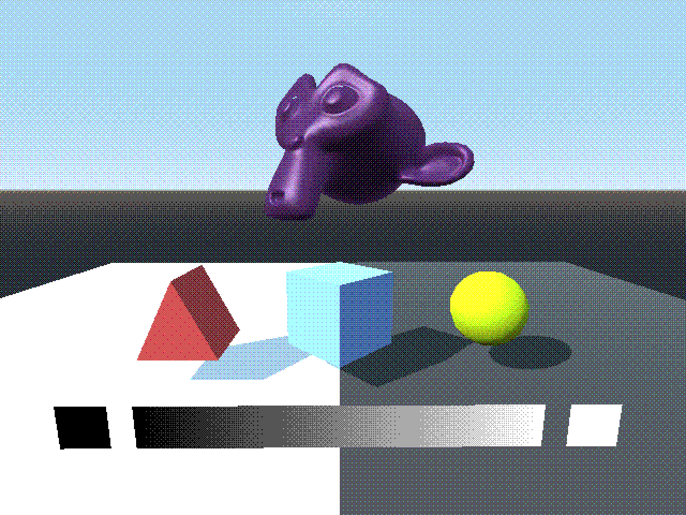
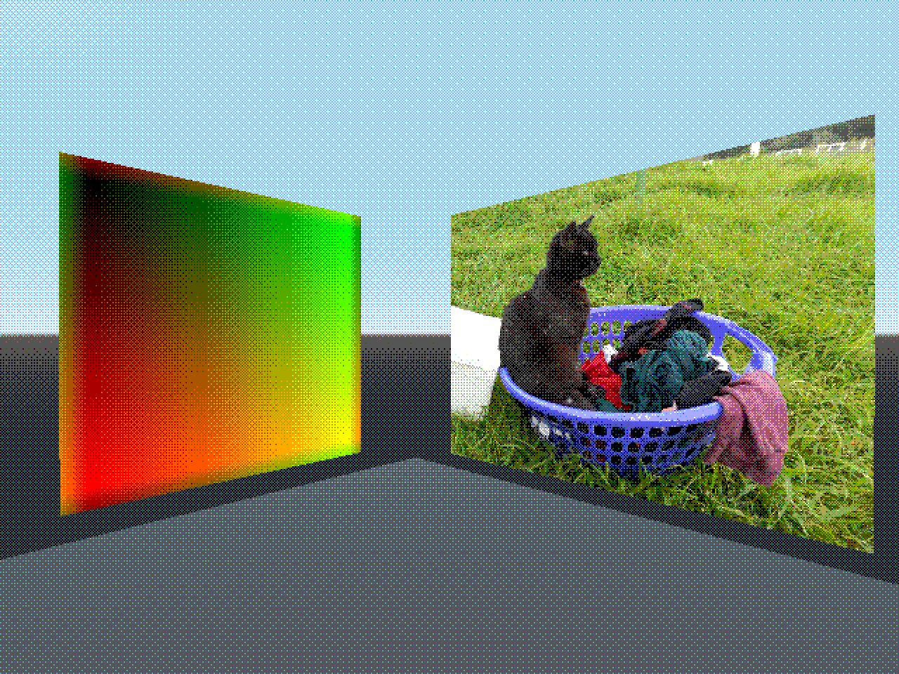

# Godot Dithering Shader

A screen-space viewport shader for Godot (GLES2 or GLES3), replicating the ordered dithering effect of older displays/image colour palettes.

(preview images have 4 colours per channel)

Supports any amount of colours, custom dither depths, and custom dithering patterns (Bayer matrices, blue noise, etc.)

[Download preview demos here (Windows, Mac, Linux)](https://drive.google.com/drive/folders/13s57wjmL6HVHuaf2sfuufRrlHdYCwIbj?usp=sharing)

## Basic setup

Following the process laid out in the [custom post-processing](https://docs.godotengine.org/en/stable/tutorials/viewports/custom_postprocessing.html#doc-custom-postprocessing) section of the Godot docs:

- Download "Godot Dithering Shader.shader" from this repo and move to your project folder
- Render target scene to Viewport contained inside ViewportContainer node
- Create a new ShaderMaterial in the ViewportContainer and load the shader into it
- Add your chosen values/pattern to the shader parameters

Make sure to disable texture filtering on your dithering pattern!

## Limitations

- Requires a dithering texture locked to viewport size (e.g. 640x480 viewport requires 640x480 dithering pattern texture)

## Issues

- if using GLSL2, will not work in HTML5 export (requires dynamic loops)
- Hangs sometimes when playing project from editor (doesn't seem to affect exports)

## Demo scene credits

- PM5644 test image created by RTFMASAP on Wikimedia Commons (https://commons.wikimedia.org/wiki/File:PM5644-1920x1080.gif), under CC BY-SA 3.0 (https://creativecommons.org/licenses/by-sa/3.0/deed.en)